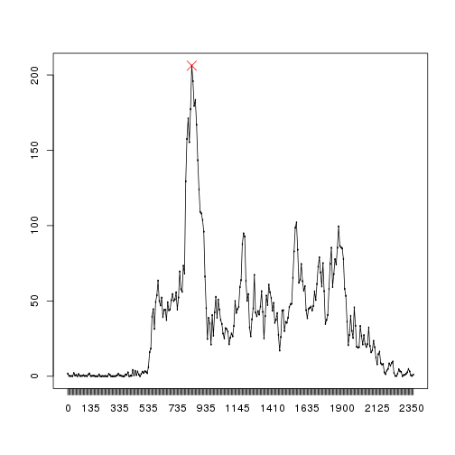
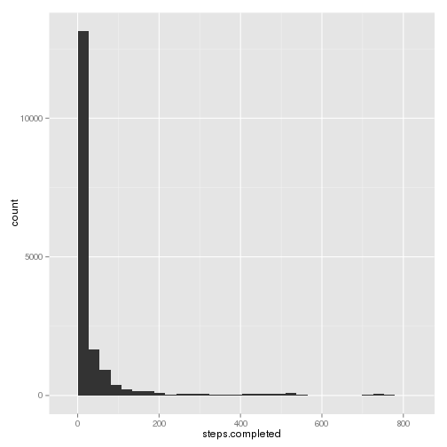
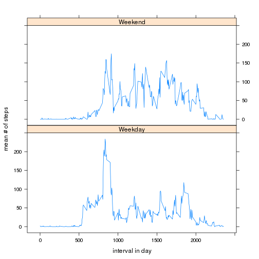

# Reproducible Research: Peer Assessment 1


## Loading and preprocessing the data

```r
unzip(zipfile = "./activity.zip")
data <- read.csv(file = "./activity.csv")
data$date <- as.Date(data$date)
summary(data)
```

```
##      steps            date               interval   
##  Min.   :  0.0   Min.   :2012-10-01   Min.   :   0  
##  1st Qu.:  0.0   1st Qu.:2012-10-16   1st Qu.: 589  
##  Median :  0.0   Median :2012-10-31   Median :1178  
##  Mean   : 37.4   Mean   :2012-10-31   Mean   :1178  
##  3rd Qu.: 12.0   3rd Qu.:2012-11-15   3rd Qu.:1766  
##  Max.   :806.0   Max.   :2012-11-30   Max.   :2355  
##  NA's   :2304
```


## What is mean total number of steps taken per day?

```r
library(ggplot2)
qplot(steps, data = data, geom = "histogram", binwidth = 40)
```

 

```r
# not clear if we have to cut by day... mn <- aggregate(steps ~
# cut(data$date, 'day'), data=data, FUN=mean, na.rm=T) md <- aggregate(steps
# ~ cut(data$date, 'day'), data=data, FUN=median, na.rm=T)
```


Mean steps per day is 37.3826.
Median steps per day is 0.


## What is the average daily activity pattern?

```r
y <- list(as.factor(data$interval))
mean.by.5 <- aggregate(data$steps, y, mean, na.rm = T)
names(mean.by.5) <- c("interval", "mn")

plot(mean.by.5$interval, mean.by.5$mn, type = "n")
lines(mean.by.5$interval, mean.by.5$mn)
max.point <- mean.by.5[which(mean.by.5$mn == max(mean.by.5$mn)), ]
points(max.point, pch = 4, cex = 2, col = "red")
```

 


5'-interval with max steps in avg across all days: 835 with 206.1698 steps in average.

## Imputing missing values
Number of rows with NAs is 15264.

We're going to fill the gaps following the simplest way:
missing value for a the `x`th 5 minutes interval in a day will got the mean of all the non NAs values for this interval.


```r
data$steps.completed <- data$steps
for (m in levels(mean.by.5$interval)) {
    idx <- which(is.na(data$steps.completed) & data$interval == m)
    init <- data[idx, ]$steps.completed
    v <- mean.by.5[mean.by.5$interval == m, ]$mn
    data[idx, ]$steps.completed <- v
    after <- data[idx, ]$steps.completed
}
```


Now the number of NAs is 0.


```r
qplot(steps.completed, data = data, geom = "histogram")
```

```
## stat_bin: binwidth defaulted to range/30. Use 'binwidth = x' to adjust this.
```

 

```r
# not clear if we have to cut by day... mn <- aggregate(steps ~
# cut(data$date, 'day'), data=data, FUN=mean, na.rm=T) md <- aggregate(steps
# ~ cut(data$date, 'day'), data=data, FUN=median, na.rm=T)
```


Mean steps per day is 37.3826.
Median steps per day is 0.

The mean and median doesn't change most probably because the data is skewed at 0 steps (median invariant) and we used the mean to fulfill the missing values (the mean invariant).


## Are there differences in activity patterns between weekdays and weekends?

```r
library(lattice)
data$weekend <- weekdays(data$date) %in% c("Saturday", "Sunday")
data[data$weekend == T, ]$weekend <- "Weekend"
data[data$weekend == F, ]$weekend <- "Weekday"
gs <- list(as.factor(data$interval), as.factor(data$weekend))
completed.mean.by.5 <- aggregate(data$steps, gs, mean, na.rm = T)
names(completed.mean.by.5) <- c("interval", "weekend", "mn")
xyplot(mn ~ as.numeric(as.vector(completed.mean.by.5$interval)) | weekend, type = "l", 
    data = completed.mean.by.5, layout = c(1, 2), xlab = "interval in day", 
    ylab = "mean # of steps")
```

 
